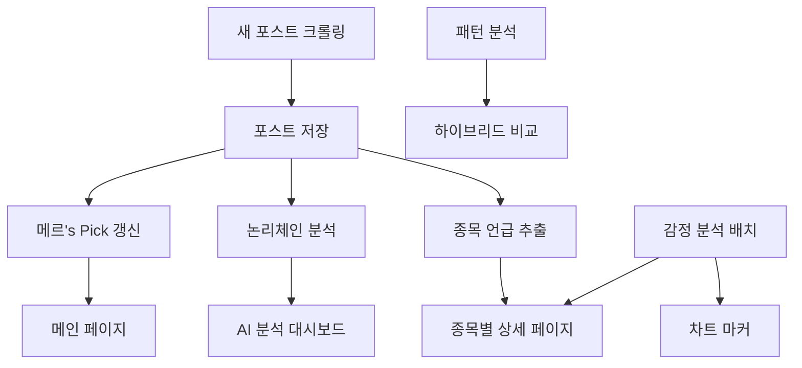

# 🔗 서비스 의존성 관계도

> **메르 블로그 플랫폼 내 서비스 간 의존성과 데이터 흐름 매핑**

---

## 📊 시스템 아키텍처 개요



---

## 🗄️ 데이터베이스 의존성

### 핵심 테이블 관계
```sql
-- 포스트 → 모든 서비스의 기본 데이터
blog_posts (기본 테이블)
├── causal_chains (논리체인 분석)
├── post_stock_sentiments (감정 분석)  
├── merry_mentioned_stocks (메르's Pick)
└── merry_pattern_analysis (패턴 분석)
```

### 테이블별 의존성

#### `blog_posts` (최상위 테이블)
- **의존하는 테이블**: 없음 (독립적)
- **영향받는 서비스**: 모든 서비스
- **갱신 주기**: 새 포스트 크롤링 시

#### `merry_mentioned_stocks` (메르's Pick)
- **의존 테이블**: `blog_posts`
- **갱신 조건**: 새 포스트에 종목 언급 발견 시
- **영향받는 페이지**: `/`, `/merry/stocks/[ticker]`

#### `causal_chains` (논리체인)
- **의존 테이블**: `blog_posts`
- **갱신 조건**: 논리적 연결고리가 발견된 포스트
- **영향받는 페이지**: `/merry/analysis`, `/merry`

#### `post_stock_sentiments` (감정 분석)
- **의존 테이블**: `blog_posts`, `merry_mentioned_stocks`
- **갱신 조건**: 수동 배치 실행
- **영향받는 페이지**: `/merry/stocks/[ticker]` (차트 마커)

---

## 🔄 서비스 갱신 체인

### 1차 갱신 (크롤링 시 자동)
```
새 포스트 → blog_posts 저장
         ↓
    종목 언급 검색 → merry_mentioned_stocks 갱신
         ↓
    논리체인 분석 → causal_chains 저장
         ↓
    메르's Pick 업데이트 완료
```

### 2차 갱신 (수동 실행)
```
감정 분석 배치 실행
         ↓
    post_stock_sentiments 저장
         ↓
    종목별 차트 마커 색상 갱신
         ↓
    감정 툴팁 정보 표시
```

### 3차 갱신 (선택적)
```
패턴 분석 실행
         ↓
    merry_pattern_analysis 갱신
         ↓
    하이브리드 비교 시스템 업데이트
```

---

## 🎯 페이지별 의존 서비스

### 메인 페이지 (`/`)
**필수 의존성**:
- `blog_posts` (최신 포스트)
- `merry_mentioned_stocks` (메르's Pick)

**선택적 의존성**:
- 없음

**갱신 필요 조건**:
- 새 포스트 추가
- 새 종목 언급

### 메르 블로그 (`/merry`)
**필수 의존성**:
- `blog_posts` (전체 포스트 목록)
- `causal_chains` (논리체인 분석 결과)

**선택적 의존성**:
- `merry_mentioned_stocks` (종목 관련 필터링)

**갱신 필요 조건**:
- 새 포스트 추가
- 논리체인 분석 완료

### 종목 상세 페이지 (`/merry/stocks/[ticker]`)
**필수 의존성**:
- `blog_posts` (관련 포스트)
- `merry_mentioned_stocks` (종목 기본 정보)

**선택적 의존성**:
- `post_stock_sentiments` (감정 분석 마커)
- `stock_prices` (차트 데이터)

**갱신 필요 조건**:
- 해당 종목 언급 포스트 추가
- 감정 분석 배치 실행

### AI 분석 대시보드 (`/merry/analysis`)
**필수 의존성**:
- `causal_chains` (논리체인 시각화)
- `blog_posts` (분석 대상 포스트)

**선택적 의존성**:
- `merry_pattern_analysis` (패턴 분석)
- `post_stock_sentiments` (감정 트렌드)

**갱신 필요 조건**:
- 새로운 논리체인 분석 완료
- 패턴 분석 실행

---

## ⚡ 성능 최적화 의존성

### 캐싱 전략
```
브라우저 캐시 (12시간)
├── 메인 페이지 메르's Pick
├── 종목별 포스트 목록
└── 논리체인 분석 결과

서버 캐시 (Redis)
├── API 응답 데이터
├── 계산된 통계
└── 감정 분석 결과

데이터베이스 인덱스
├── blog_posts.created_date
├── merry_mentioned_stocks.last_mentioned_at  
└── post_stock_sentiments.post_id, ticker
```

### 로딩 순서 최적화
1. **즉시 로딩**: 기본 포스트 데이터
2. **지연 로딩**: 논리체인 분석 결과
3. **비동기 로딩**: 감정 분석 마커
4. **백그라운드**: 패턴 분석 데이터

---

## 🚨 장애 대응 시나리오

### 크롤링 시스템 장애
**영향 범위**:
- 새 포스트 누락
- 메르's Pick 업데이트 중단
- 논리체인 분석 중단

**대응 방안**:
- 수동 크롤링 실행
- 백업 크롤러 활성화
- 데이터 무결성 검증

### 감정 분석 시스템 장애
**영향 범위**:
- 차트 마커 색상 표시 안됨
- 감정 툴팁 정보 누락

**대응 방안**:
- 기본 파란색 마커로 대체
- 분석 스크립트 재실행
- 오류 로그 확인

### 데이터베이스 장애
**영향 범위**:
- 전체 시스템 중단

**대응 방안**:
- 백업 데이터베이스 복구
- 읽기 전용 모드 전환
- 데이터 동기화 실행

---

## 📋 점검 체크리스트

### 일일 점검
- [ ] 새 포스트 크롤링 정상 여부
- [ ] 메르's Pick 업데이트 확인
- [ ] 논리체인 분석 성공률 확인

### 주간 점검
- [ ] 감정 분석 배치 실행
- [ ] 데이터베이스 무결성 검증
- [ ] 성능 지표 모니터링

### 월간 점검
- [ ] 패턴 분석 전체 재실행
- [ ] 데이터베이스 최적화
- [ ] 서비스 의존성 재검토

---

> **🔄 갱신 주기**: 시스템 변경 시마다  
> **📊 모니터링**: 실시간 상태 확인 필요  
> **🚨 알림**: 의존성 장애 시 즉시 대응